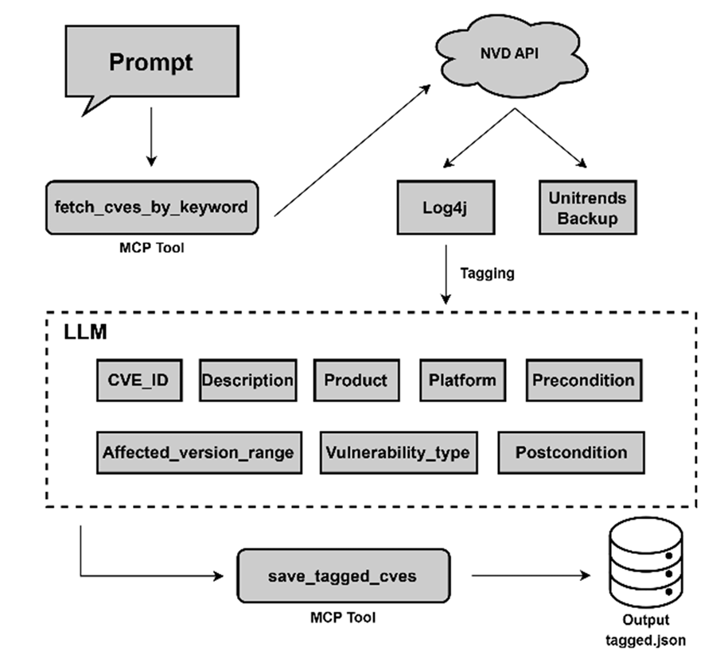

# Data Dictionary

Definitions for every data file in `dataset/` and `outputs/`.

Two case studies are included, `log4j` and `kaseya`. Both follow an identical
file layout and schema.

| File | log4j | kaseya |
|---|---|---|
| `dataset/<case>/cves.json` | 13 records | 29 records |
| `dataset/<case>/ground_truth_nodes.csv` | 13 rows | 27 rows |
| `dataset/<case>/ground_truth_edges.csv` | 16 rows | 17 rows |
| `dataset/<case>/evidence_mapping.csv` | 16 rows | 17 rows |
| `outputs/<case>/<method>/run_N.json` | 20 files | 20 files |

---

## `cves.json`

Every CVE record collected for the case study, after semantic tagging. This is
the complete pool of vulnerabilities the generation pipeline reasons over.

A JSON array of objects, each with the eight attributes below.

| Field | Type | Origin | Description |
|---|---|---|---|
| `cve_id` | string | NVD | CVE identifier, `CVE-YYYY-NNNNN` |
| `description` | string | NVD | Vulnerability description, verbatim |
| `product` | string | NVD | Affected product |
| `platform` | string | NVD | Affected platform or component |
| `affected_version_range` | string | NVD | Version range, e.g. `< 9.0.0`, `2.0-beta9 to 2.14.1` |
| `vulnerability_type` | string | LLM, normalized | Weakness category, e.g. `Remote Code Execution (RCE)`, `Privilege Escalation`, `Denial of Service (DoS)` |
| `precondition` | string | LLM, inferred | What an attacker must already hold to exploit the vulnerability |
| `postcondition` | string | LLM, inferred | What the attacker gains after exploitation |

The **Origin** column matters when interpreting results. The first five fields
are extracted directly from NVD and are factual. `vulnerability_type` is an LLM
normalization of terminology that already appears in the description.
`precondition` and `postcondition` are inferred by the LLM and are model output,
not ground truth — they are the input to attack-link reasoning, and they are also
what the verification step checks candidate links against.

The semantic tagging step that produces these attributes is shown below. A raw
NVD record enters on the left; the five factual fields are carried through
unchanged, while `vulnerability_type` is normalized and `precondition` and
`postcondition` are inferred from the description.



The prompt used for this step is `prompts/semantic_tagging.txt`.

Example:

```json
{
  "cve_id": "CVE-2021-44228",
  "description": "Apache Log4j2 2.0-beta9 through 2.15.0 JNDI features used in ...",
  "product": "log4j",
  "platform": "Apache Log4j2",
  "affected_version_range": "2.0-beta9 through 2.15.0",
  "vulnerability_type": "Remote Code Execution (RCE)",
  "precondition": "Attacker can control log messages or log message parameters",
  "postcondition": "Arbitrary code execution from attacker-controlled LDAP server"
}
```

---

## `ground_truth_nodes.csv`

The CVE records that were used when constructing the ground truth. This is a
subset of `cves.json`, restricted to the vulnerabilities that entered candidate
link adjudication. Records in `cves.json` that no annotator considered as an
endpoint of any candidate link do not appear here.

Same eight columns as `cves.json`, in the same order:

```
cve_id, description, product, platform, affected_version_range,
vulnerability_type, precondition, postcondition
```

Field semantics are identical to `cves.json` above.

---

## `ground_truth_edges.csv`

One row per candidate attack link, holding the two independent annotation
decisions and the final decision. This file defines the ground truth.

| Column | Type | Description |
|---|---|---|
| `source_cve` | string | Preceding vulnerability in the attack relationship |
| `target_cve` | string | Following vulnerability |
| `relationship_type` | enum | One of the four relationship types below |
| `evidence_source` | string | Document consulted, e.g. `NVD`, vendor advisory, technical report |
| `evidence_excerpt_location` | string | Where in that document the supporting text appears |
| `annotator_1` | `ACCEPT` / `REJECT` | First annotator's independent decision |
| `annotator_2` | `ACCEPT` / `REJECT` | Second annotator's independent decision |
| `final_decision` | `ACCEPT` / `REJECT` | Decision after consensus resolution of disagreements |

**Rows with `final_decision = ACCEPT` constitute the ground truth.** All
evaluation scripts read this column and ignore rejected rows. Rejected rows are
retained because they document what was considered and turned down, and because
they are needed to compute inter-annotator agreement.

| | Candidate links | Accepted | Rejected |
|---|---|---|---|
| log4j | 16 | 9 | 7 |
| kaseya | 17 | 13 | 4 |

Rows are keyed on `(source_cve, target_cve, relationship_type)`. The same CVE
pair may appear more than once under different relationship types and be judged
separately each time — `CVE-2021-44228 → CVE-2021-44832`, for example, was
rejected as `incomplete_fix` and accepted as `similar_attack_pattern`.

Links are directional, and the evaluation scripts compare generated links
against the direction recorded here. A link generated in the reverse direction
is counted as a direction error rather than a match.

For `incomplete_fix`, `precondition_met`, and `reconnaissance` the direction
carries meaning: it runs from the earlier remediation to the vulnerability it
failed to close, from the postcondition that is supplied to the precondition
that requires it, and from the disclosing vulnerability to the one it assists.

`similar_attack_pattern` is semantically symmetric — two vulnerabilities sharing
an exploitation mechanism share it in both directions. Each such pair is
nonetheless recorded once, in a fixed representative direction, so that
evaluation has a single target to match against. **The representative direction
places the earlier-disclosed vulnerability as `source_cve`.** Disclosure date,
not CVE number, is the criterion: `CVE-2021-44228 → CVE-2021-4104` runs against
numeric order because CVE-2021-44228 was published first.

Where both directions of a pair appear in the data they carry different
relationship types and are separate candidates. `CVE-2021-43040 →
CVE-2021-43041` is recorded as `similar_attack_pattern`, while
`CVE-2021-43041 → CVE-2021-43040` is a distinct `precondition_met` candidate
judged on its own evidence.

### Relationship types

| Type | Meaning |
|---|---|
| `incomplete_fix` | The target exists because the patch for the source was incomplete |
| `precondition_met` | The postcondition of the source satisfies the precondition of the target |
| `similar_attack_pattern` | Both are exploited through the same underlying mechanism |
| `reconnaissance` | The source discloses information that enables exploitation of the target |

Distribution among accepted links:

| Type | log4j | kaseya |
|---|---|---|
| `incomplete_fix` | 2 | 0 |
| `precondition_met` | 0 | 6 |
| `similar_attack_pattern` | 6 | 7 |
| `reconnaissance` | 1 | 0 |
| **Total** | **9** | **13** |

---

## `evidence_mapping.csv`

The evidence trail behind each link decision, covering rejected candidates as
well as accepted ones. One row per row of `ground_truth_edges.csv`, joined on
`(source_cve, target_cve, relationship_type)`.

| Column | Type | Description |
|---|---|---|
| `source_cve` | string | Preceding vulnerability |
| `target_cve` | string | Following vulnerability |
| `relationship_type` | enum | Same value as in `ground_truth_edges.csv` |
| `final_decision` | `ACCEPT` / `REJECT` | Same value as in `ground_truth_edges.csv` |
| `evidence_source` | string | Document consulted |
| `evidence_excerpt_location` | string | Where in that document the supporting text appears |
| `excerpt_summary` | string | Summary of what the evidence states, in the annotators' words |

The first six columns duplicate `ground_truth_edges.csv` so the file can be read
on its own. `excerpt_summary` is the column unique to this file, and is what
makes each decision auditable — for rejected links it records why the evidence
was judged insufficient.

Joining the two files on `(source_cve, target_cve)` alone will attach the wrong
summary wherever a CVE pair appears under more than one relationship type.
`relationship_type` must be part of the join key.

---

## `outputs/<case>/<method>/run_N.json`

One generated attack graph. `N` runs from 1 to 5.

| Method directory | Description |
|---|---|
| `standard_prompting` | Single-pass generation, no examples, retrieval, or verification |
| `few_shot_cot` | Single-pass generation with worked reasoning examples |
| `self_consistency` | Five candidate graphs aggregated by majority voting |
| `proposed` | Majority voting followed by evidence-based verification |

### Top level

| Field | Type | Description |
|---|---|---|
| `metadata` | object | Run identification and summary counts |
| `nodes` | array | Vulnerabilities appearing in the graph |
| `links` | array | Directed attack relationships between them |

### `links` entries

| Field | Type | Description |
|---|---|---|
| `source` | string | Preceding vulnerability |
| `target` | string | Following vulnerability |
| `relation_type` | string | Relationship type asserted by the model |
| `description` | string | Explanation of the relationship generated by the model |

Example:

```json
{
  "source": "CVE-2021-44228",
  "target": "CVE-2021-45046",
  "relation_type": "incomplete_fix",
  "description": "The description explicitly states that the fix to address CVE-2021-44228 in Apache Log4j 2.15.0 was incomplete"
}
```

`description` is model output, not verified evidence. In the proposed method it
is checked against the structured attributes of the two endpoints, and links
whose explanation is not supported are removed; in the other three methods it is
recorded as generated and never re-examined.

Standard prompting is not supplied with the four-type taxonomy, so its
`relation_type` values are uncontrolled free text. The evaluation scripts treat
any value outside the taxonomy as a classification error when the node pair and
direction are otherwise correct.

Generated links are not guaranteed to be unique. A single run may assert the same
`(source, target)` pair more than once with different explanations; the
evaluation scripts deduplicate on the pair before scoring.

---

## Conventions

All CSV files are UTF-8 encoded with a header row. CVE identifiers use the
canonical uppercase `CVE-YYYY-NNNNN` form throughout, and the evaluation scripts
normalize case before matching. Empty cells mean the attribute was not present in
the source document, and are distinct from a cell recording an explicit absence.