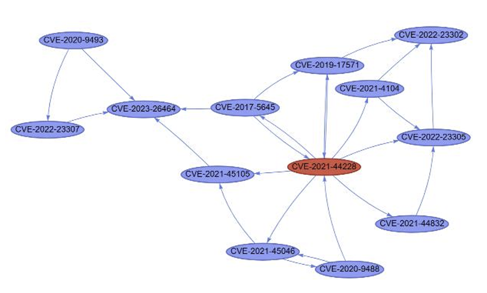
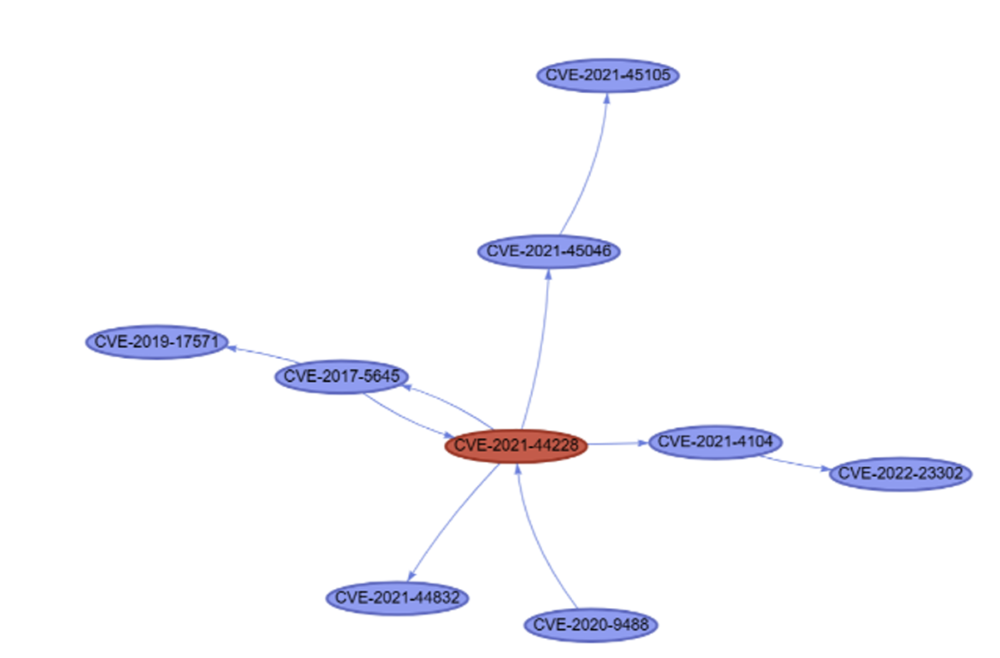
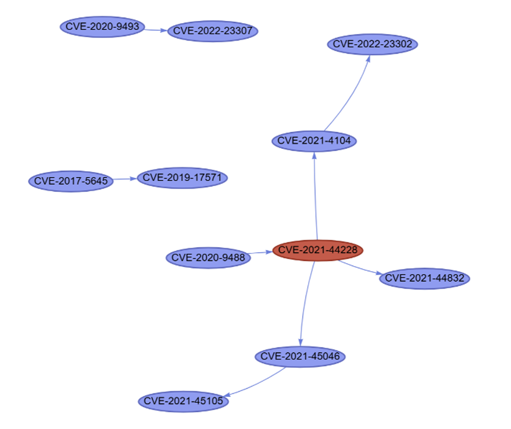

# Reliable Attack Graph Generation with Self-Consistency and Chain-of-Verification

Large language models can infer attack relationships between vulnerabilities, but
two failure modes limit their practical use: repeated runs on identical input
produce different graphs, and generated relationships are not always supported by
technical evidence.

This repository implements a generation pipeline that addresses both. Raw CVE
records are first normalized into structured vulnerability attributes, and the
precondition and postcondition of each vulnerability are semantically tagged.
Multiple candidate
attack graphs are then generated independently and aggregated by majority voting
(Self-Consistency). Every surviving relationship is finally re-checked against the
structured attributes of its two endpoints, and relationships without supporting
evidence are removed (Chain-of-Verification).

The repository contains the datasets, prompts, generated graphs from all
experimental runs, and the evaluation scripts used to score them.


---

## Repository structure

```
dataset/
  log4j/
    cves.json                  All CVE records collected for the case
    ground_truth_nodes.csv     CVE records used to build the ground truth
    ground_truth_edges.csv     Candidate attack links and annotation decisions
    evidence_mapping.csv       Detailed rationale for each link decision
  kaseya/
    ...                        Same four files

outputs/
  log4j/
    standard_prompting/        run_1.json ... run_5.json
    few_shot_cot/
    self_consistency/
    proposed/
  kaseya/
    ...                        Same four methods

prompts/
  semantic_tagging.txt         CVE description -> structured attributes
  candidate_generation.txt     Candidate attack graph generation
  verification.txt             Evidence-based link verification

scripts/
  evaluate_structure.py        Generation consistency across repeated runs
  evaluate_links.py            Link quality against the ground truth
  error_analysis.py            Error categorization and representative cases

src/
  server.py                    MCP server exposing the pipeline tools
  dashboard.py                 Interactive attack graph viewer

DATA_DICTIONARY.md             File and column definitions
ANNOTATION_GUIDELINES.md       Ground-truth annotation procedure
```

---

## Getting started

Clone the repository and run any evaluation script from the repository root:

```bash
git clone https://github.com/SMU-ISE/sc-cov-attack-graph.git
cd sc-cov-attack-graph
python scripts/evaluate_links.py --dataset log4j
```

The three evaluation scripts use only the Python standard library, so no
installation step is required. Python 3.8 or later is sufficient.

The MCP server and the dashboard in `src/` are separate from the evaluation
scripts and require additional packages; see [Pipeline tools](#pipeline-tools).

---

## Usage

All scripts take `--dataset log4j` or `--dataset kaseya`, and read generated
graphs from `outputs/` and the ground truth from `dataset/`. Both directories can
be relocated with `--outputs-dir` and `--gt`.

### Generation consistency

Counts the links produced in each of the five runs per method and reports the
mean, standard deviation, and coefficient of variation of the link counts. Lower
values indicate more reproducible generation.

```bash
python scripts/evaluate_structure.py --dataset log4j
python scripts/evaluate_structure.py --dataset kaseya
```

### Link quality

Compares generated links with the ground truth and reports TP, FP, FN,
Precision, Recall, and F1-score for each method, averaged over the five runs.

```bash
python scripts/evaluate_links.py --dataset log4j
python scripts/evaluate_links.py --dataset kaseya
```

Links are matched on the `(source, target)` pair by default. Use
`--match strict` to require the relationship type to match as well, and
`--per-run` to print the breakdown for each individual run.

```bash
python scripts/evaluate_links.py --dataset log4j --match strict --per-run
```

### Error analysis

Assigns each generated link that does not match the ground truth to exactly one
error category — hallucinated link, direction error, or classification error —
and counts ground-truth links that were never generated as missing links.
Representative cases are printed for each category.

```bash
python scripts/error_analysis.py --dataset log4j
python scripts/error_analysis.py --dataset kaseya
```

`--examples N` controls how many representative cases are shown per category
(default 2), and `--csv path.csv` writes the full per-link classification to a
file for inspection.

```bash
python scripts/error_analysis.py --dataset kaseya --examples 5 --csv kaseya_errors.csv
```

---

## Datasets

Each case study directory contains four files. `cves.json` holds every CVE record
collected for the case, and `ground_truth_nodes.csv` holds the subset that was
used when building the ground truth. `ground_truth_edges.csv` records each
candidate attack link together with the two independent annotation decisions and
the final decision; links marked `ACCEPT` form the ground truth used by
`evaluate_links.py` and `error_analysis.py`. `evidence_mapping.csv` records the
detailed rationale behind each link decision, covering rejected candidates as
well as accepted ones.

Column definitions are in [DATA_DICTIONARY.md](DATA_DICTIONARY.md), and the
annotation procedure is documented in
[ANNOTATION_GUIDELINES.md](ANNOTATION_GUIDELINES.md).

---

## Generated graphs

`outputs/<dataset>/<method>/run_N.json` contains one generated attack graph.
Four methods are included:

| Directory | Description |
|---|---|
| `standard_prompting` | Single-pass generation with no examples, retrieval, or verification |
| `few_shot_cot` | Single-pass generation with worked reasoning examples |
| `self_consistency` | Five candidate graphs aggregated by majority voting |
| `proposed` | Majority voting followed by evidence-based verification |

Each file holds a `metadata` object, a `nodes` array, and a `links` array. Each
link records its source, target, relationship type, and the model-generated
explanation of the relationship. In the proposed method, that explanation is
checked against the structured attributes of the two endpoints.

Relationships are drawn from four types: `incomplete_fix`, `precondition_met`,
`similar_attack_pattern`, and `reconnaissance`. Standard prompting is not given
this taxonomy, so its outputs contain uncontrolled type labels; the evaluation
scripts count these as classification errors.

---

## Results at a glance

The same Log4j dataset, generated by three of the methods. Each image is the
first run of that method.

| Standard Prompting | Few-shot CoT | Proposed |
|---|---|---|
|  |  |  |
| 24 links | 11 links | 8 links |

Standard prompting produces a dense graph in which most relationships rest on
surface similarity between vulnerabilities. Few-shot reasoning removes many of
them but keeps its own unsupported inferences. The proposed method retains only
the relationships that survive both majority voting and evidence verification.

Each of these graphs can be opened directly:

```bash
streamlit run src/dashboard.py
```

then load `outputs/log4j/standard_prompting/run_1.json`,
`outputs/log4j/few_shot_cot/run_1.json`, or
`outputs/log4j/proposed/run_1.json`.

---

## Prompts

The three prompts in `prompts/` are the exact text used in the experiments.
`{DATASET}` is replaced with the case study name and `{CENTRAL_CVE}` with the CVE
under analysis.

`semantic_tagging.txt` converts a raw CVE description into the eight structured
attributes. `candidate_generation.txt` produces one candidate attack graph.
`verification.txt` re-checks a single candidate link against the structured
attributes of its endpoints and returns a keep or drop decision with a reason.

---

## Pipeline tools

`src/server.py` is an MCP server that exposes the pipeline as callable tools:
CVE retrieval from the NVD API, loading and saving tagged records, saving and
loading candidate graphs, and saving the final verified graph. `src/dashboard.py`
renders any generated graph as an interactive network, with node attributes and
link evidence shown on hover.

These require `mcp`, `nvdlib`, `streamlit`, `pyvis`, and `networkx`.

```bash
python src/server.py
streamlit run src/dashboard.py
```

---

## Reproducibility

All generation steps — semantic tagging, candidate graph generation, and
verification — were run with **Claude Sonnet 4.5**.

LLM generation is non-deterministic, so re-running the pipeline will not
reproduce the files under `outputs/` exactly, even with the same model and
prompts. The graphs committed to this repository are the actual experimental
outputs; the evaluation scripts score those files and will reproduce the
reported numbers deterministically.

---

## License

Code is released under the MIT License. Datasets are released under CC BY 4.0.
CVE records are derived from the National Vulnerability Database maintained by
NIST.